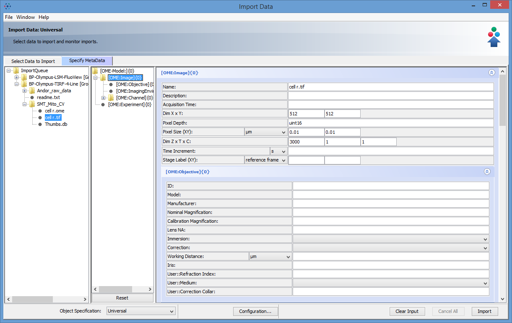
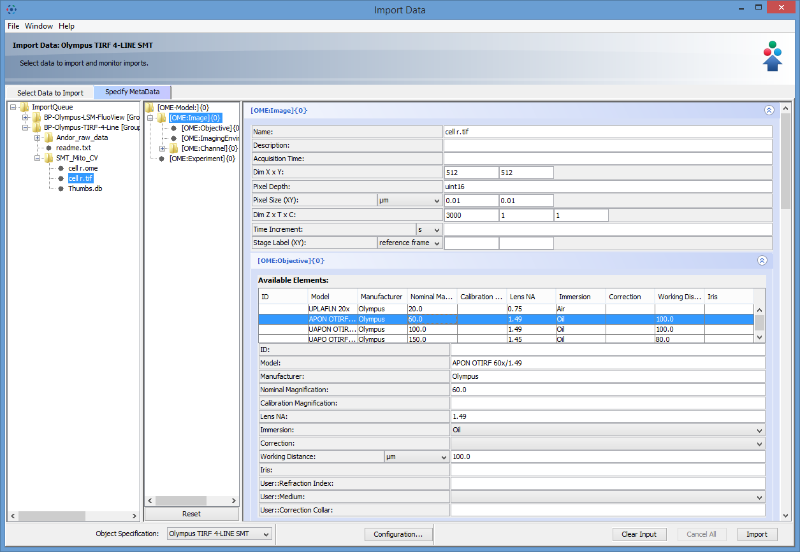
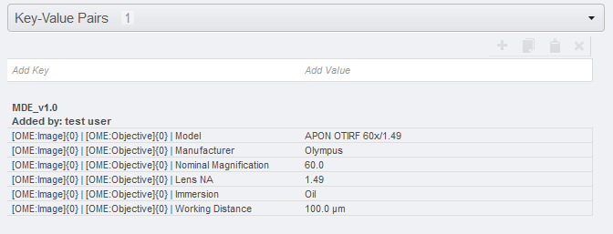
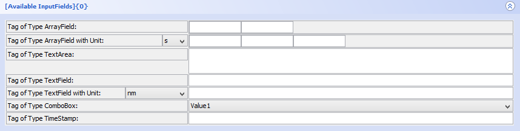

  OMERO.mde 
  ---------------------

  Extension of OMERO.importer to get an overview of available metadata provided by the selected image container and annotate images at import step by standardized key-value templates. Changes of metadata provided by image will save as key-value pairs.
  
  Workflow example
  --------------------
  In this example we load data from an Olympus TIRF Setup. There is no information about the objective in the image container.
  

  
  

  When you have specified your objectives for your Olympus TIRF Setup (see section Customize MDE), you can load these objectives by choosing object specification: Olympus TIRF. Now one of the objectives could be adopt from the list of available Elements or you can add manually the missing information.
   

  
  

  After the import you will find your annotation under General>Key-Value Pairs. 
   

  
  

  Customize MDE
  ---------------------
  Save mdeConfiguration.xml in the directory &lt;user &gt;/omero/ to specify available objects and how the looks like. You can use the mdeConfiguration.xml example file or create a new under OMERO.importer>MDE>Configuration...>Save To File.
	
  The microscope element can be understood more generally as a template category.
  
  mdeConfiguration.xml: Element MDEObjects (in progress)
  ---------------------
  Default: 
  
    <Microscope Name="Universal">
    
 hold all available object specifications. Predefined are most of objects specified in the ome schema (https://www.openmicroscopy.org/Schemas/Documentation/Generated/OME-2016-06/ome.html). 
  
  You can add a child 
  
    <Object Type=<yourObjectName>> 
    
  in this element to create a new custom object with key-values as `TagData` elements (see example object `Available InputFields` in mdeConfiguration.xml in this repository). 
  Please specify an insertion point for every object by defining a parent object. 
  E.g. object OME:Detector has the insertion OME:Channel - that means that OME:Detector can only be a subobject of an OME:Channel object.
  
    <Parents Values="OME:Channel" />
  For any new microscope you add to the xml MDEObject element you can specify which of these objects are available and how the looks like (overwrite TagData properties by defining `TagDataProp` to hide a TagData or change default unit).
  
  
  TagData
  ---------------------------------
  There are different editor input field types for TagData:
  

  
  

  
  `TextField` define like: 
  
      <TagData DefaultValues="" 
                Name="Tag of Type TextField" 
                Type="TextField" 
                Unit=""
                Value="" 
                Visible="true" />
		
`TextField with unit` define like: 
  
      <TagData DefaultValues="" 
                Name="Tag of Type TextField with unit" 
                Type="TextField" 
                Unit="nm"
                Value="" 
                Visible="true" />
  `TextArea` define like:
  
      <TagData DefaultValues="" 
                Name="Tag of Type TextArea" 
                Type="TextArea"
                Unit="" 
                Value="" 
                Visible="true" />
  `ArrayField` define like (for an array of 2 elements):
  
    <TagData DefaultValues="2" 
              Name="Tag of Type ArrayField"
              Type="ArrayField" 
              Unit="" 
	      Value="" 
              Visible="true" />
	      
 `ArrayField` with unit define like (for an array of 3 elements):
  
    <TagData DefaultValues="3" 
              Name="Tag of Type ArrayField with unit"
              Type="ArrayField" 
              Unit="s" 
	      Value="" 
              Visible="true" />
  `ComboBox` define like:
  
    <TagData DefaultValues="Value1,Value2,Value3"
    	      Name="tag of Type ComboBox" 
              Type="ComboBox" 
              Unit="" 
              Value="Value1"
              Visible="true" />
          
  `TimeStamp` define like:
  
    <TagData DefaultValues="" 
              Name="Tag of Type TimeStamp"
              Type="TimeStamp" 
              Unit="" 
              Value="" 
              Visible="true" />
  
  
  
  mdeConfiguration.xml: Element MDEHardwareConfiguration
  -------------------------
  List of available instruments (==objects) for specified microscope. E.g.
  LeicaLSM SP5 instruments:
    
    OME:Dichroic,OME:Detector,OME:Laser,OME:Arc,OME:Objective,OME:Filter
    
  

  
  

  Please specify new elements by using the `Configuration` dialog in MDE.
 

  Licensing
  ---------

  This software is licensed under the terms of the GNU General Public
  License (GPL), the full text of which can be found in
  the top level LICENSE.txt. See https://www.openmicroscopy.org/licensing/
  for further details.

  Copyright
  ---------

  Copyright (C) 2006-2019 University Osnabrueck. All rights reserved.
