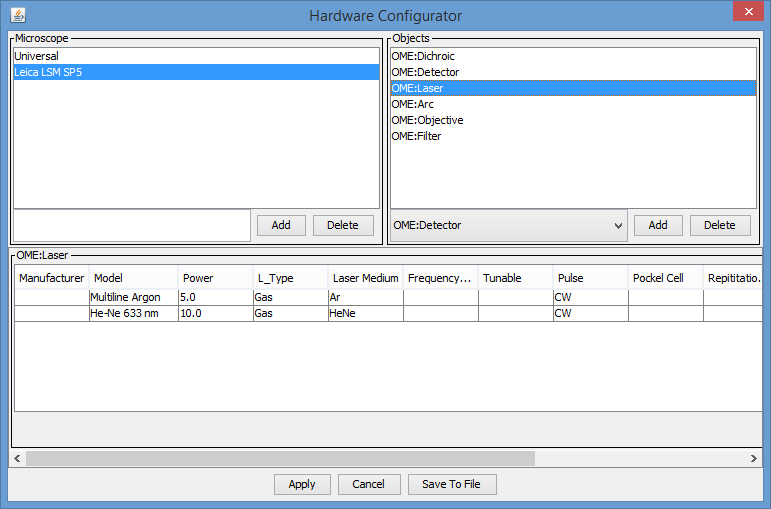

  OMERO.mde 
  ---------------------

  Extension of OMERO.importer to get an overview of available metadata provided by the selected image container and annotate images at import step by standardized key-value templates. 

  MDE configuration file
  ---------------------
  Save mdeConfiguration.xml in the directory <user>/omero/ to specify available objects and how the look likes.
  The microscope element can be understood more generally as a template category.
  
  Element MDEObjects (in progress)
  ---------------------
  Default: 
  
    <Microscope Name="Universal">
    
 holds most of objects specified in the ome schema (https://www.openmicroscopy.org/Schemas/Documentation/Generated/OME-2016-06/ome.html). 
  
  You can add a child 
  
    <Object Type=<yourObjectName>> 
    
  in this element to create a new custom object with key-values as `TagData` elements. 
  Please specify an insertion point for every object by defining a parent object. 
  E.g. object OME:Detector has the insertion OME:Channel - that means that OME:Detector can only be a subobject of an OME:Channel object.
  
    <Parents Values="OME:Channel" />
  
  There are different editor input field types for TagData:
  
  `TextField` define like: 
  
      <TagData DefaultValues="" 
                Name="Name" 
                Type="TextField" 
                Unit=""
                Value="" 
                Visible="true" />
  `TextArea` define like:
  
      <TagData DefaultValues="" 
                Name="Description" 
                Type="TextArea"
                Unit="" 
                Value="" 
                Visible="true" />
  `ArrayField` define like (for an array of 2 elements):
  
    <TagData DefaultValues="2" 
              Name="Dim X x Y"
              Type="ArrayField" 
              Unit="" Value="" 
              Visible="true" />
  `ComboBox` define like:
  
    <TagData DefaultValues="CCD,IntensifiedCCD,AnalogVideo,PMT,Photodiode,Spectroscopy,LifetimeImaging,
                              CorrelationSpectroscopy,FTIR,EMCCD,APD,CMOS,EBCCD,Other"
					    Name="DetectorType" 
              Type="ComboBox" 
              Unit="" 
              Value="PMT"
              Visible="true" />
          
  `TimeStamp` define like:
  
    <TagData DefaultValues="" 
              Name="Acquisition Time"
              Type="TimeStamp" 
              Unit="" 
              Value="" 
              Visible="true" />
  
  
  Element MDEHardwareConfiguration
  -------------------------
  List of available instruments (==objects) for specified microscope. E.g.
  LeicaLSM SP5 instruments:
    
    OME:Dichroic,OME:Detector,OME:Laser,OME:Arc,OME:Objective,OME:Filter
    
  

  
  

     
 

  Licensing
  ---------

  This software is licensed under the terms of the GNU General Public
  License (GPL), the full text of which can be found in
  the top level LICENSE.txt. See https://www.openmicroscopy.org/licensing/
  for further details.

  Copyright
  ---------

  Copyright (C) 2006-2019 University Osnabrueck. All rights reserved.
